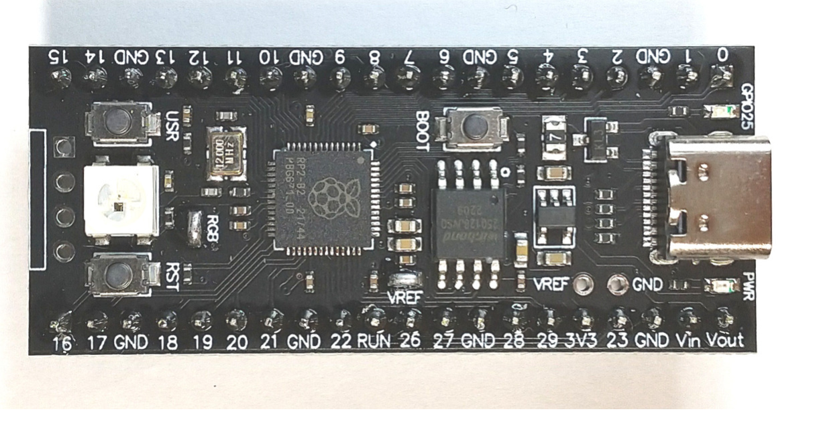
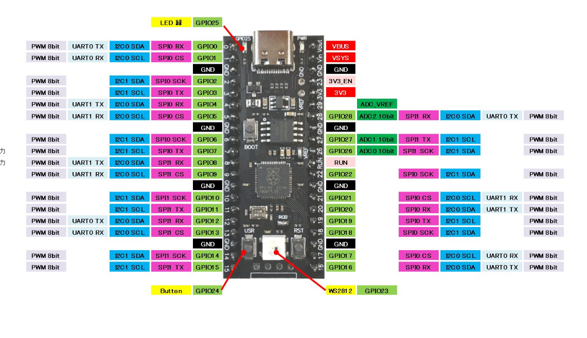

# RP2040 USB to UART Bridge (VCC-GND Board Edition)

A high-performance USB-to-TTL serial adapter firmware for RP2040 boards, specifically optimized for the "VCC-GND" style boards with an onboard WS2812 ARGB LED.



## Features
- **USB CDC to UART**: Transparent bridge between USB and physical UART.
- **Optimized Pinout**: Uses GPIO 0 (TX) and GPIO 1 (RX) for easy wiring.
- **DTR/RTS Support**: Full hardware control for flashing ESP32/ESP8266 and other devices.
- **Visual Feedback**:
    - **Red**: Not Ready / Disconnected.
    - **Dim Green**: Idle / Ready.
    - **Blue Flash**: RX Activity (from device).
    - **Orange Flash**: TX Activity (to device).
- **Onboard LED**: GP25 indicates active USB connection.

## Pinout
| Pin Name | GPIO | Board Header Position |
|----------|------|-----------------------|
| **TX**   | 0    | Top-Left              |
| **RX**   | 1    | Next to TX            |
| **GND**  | -    | Next to RX            |
| **DTR**  | 2    | Next to GND           |
| **RTS**  | 3    | Next to DTR           |



## Building
1. Install [Pico SDK](https://github.com/raspberrypi/pico-sdk) and ARM GCC toolchain.
2. Initialize build:
   ```bash
   mkdir build
   cd build
   export PICO_SDK_PATH=path/to/pico-sdk
   cmake ..
   make
   ```
3. Flash `uart_bridge.uf2` to your board.

## Credits
Based on [rpzero-usb-uart](https://github.com/denandz/rpzero-usb-uart) by denandz.
